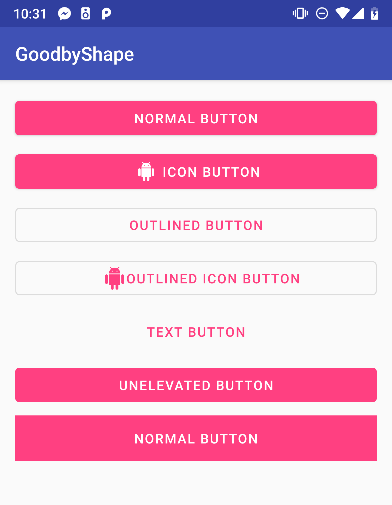
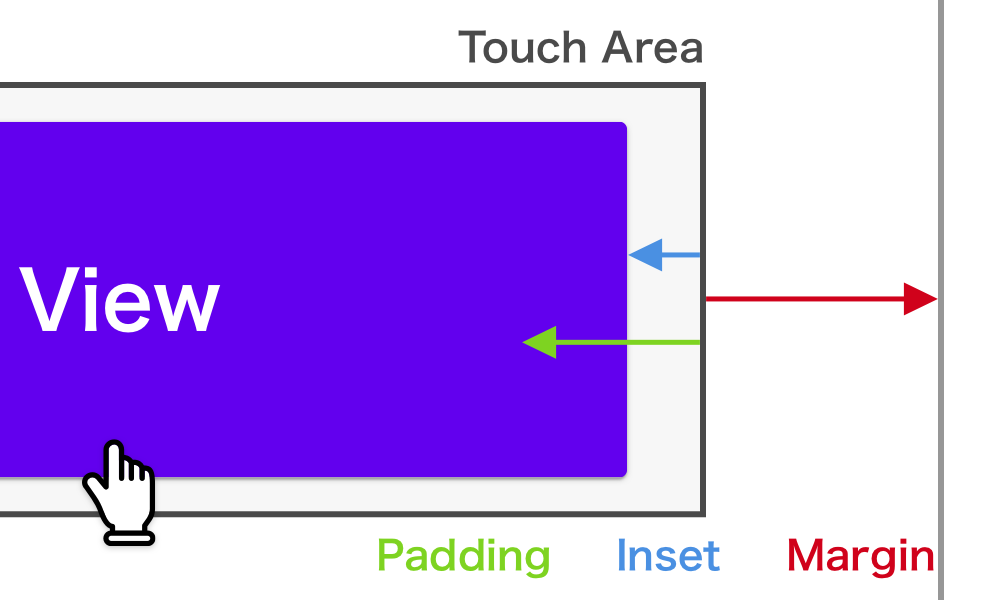
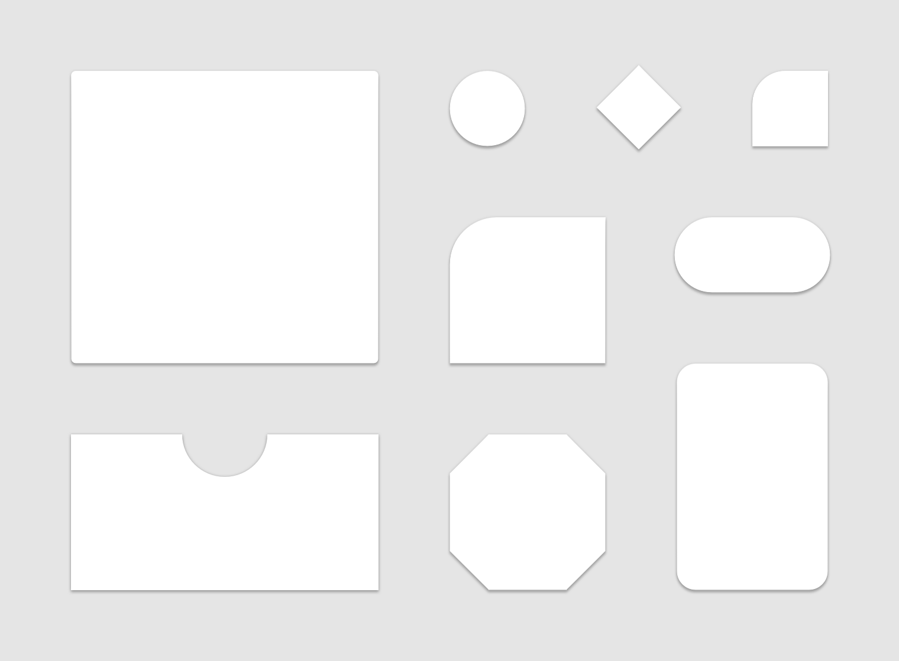
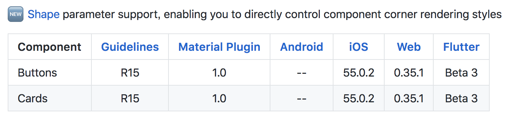
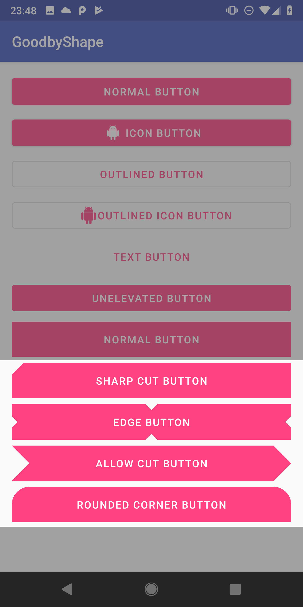

# Goodbye `shape` :wave: 

---

## About me

- Accounts
    - アカウント名： `@Reyurnible`
- Work:
    - フリーランス
        - アプリエンジニアなど

---

## はじめに

最近、1からAndroidXと、MaterialThemingに対応したアプリを作る機会がありました。
その中で感じた、新しいMaterialDesignライブラリの魅力をご紹介できればと思います。

---

## 今日話すこと

今まで、いろいろ作ってたXML画像を作らなくてもだいたいのボタンなどのデザインを作れるようになりました。

今日は主にボタンの話をします。
（スライド作ってたら、ボタンの話でいっぱいに :bow: ）

---

## MaterialTheming

MaterialDesignを、実際のアプリに合わせてカスタマイズできるように少しやわらかくしたもの。[^1]

MaterialThemingを実装した各プラットフォームごとの実装などをも提供されている[^2]

[^1]: [https://material.io/design/material-theming/](https://material.io/design/material-theming/)
[^2]: [https://github.com/material-components](https://github.com/material-components)

---

## MaterialButton

MaterialDesign Guidline[^1]のボタンを実装したビュークラス。

material-designのライブラリの一部として提供されている。

実装は、AppCompatButtonをベースにしているが、ガイドラインの基本的な実装が入っておりかなり高機能。

[^1]: [https://material.io/develop/android/components/material-button/](https://material.io/develop/android/components/material-button/)

---

### デフォルトで実装できるもの



---

### よく使うスタイル

| ボタン | スタイル |
|:-------|:---------|
| 角丸ボタン | `@style/Widget.MaterialComponents.Button` |
| アイコンボタン | `@style/Widget.MaterialComponents.Button.Icon` |
| テキストボタン | `@style/Widget.MaterialComponents.Button.TextButton` |
| 外枠ボタン | `@style/Widget.MaterialComponents.Button.OutlinedButton` |

---

### よく使うプロパティ

| カテゴリ | property | 役割 |
|:--------|:---------|:----|
| 大きさ | android:inset | タッチ領域内での大きさを変えられる。デフォルトで、topとbottomに4dpついている。 |
| アイコン | app:icon | アイコンを表示させられる。drawableLeftの上位互換。 |
|         | app:iconTint | アイコンの色を変えられる。modeも別で指定できる。 |
|         | app:iconGravity | アイコンの位置をテキストに合わせるか、全体に合わせるか決められる。 |
|         | app:iconPadding | アイコンとの距離を変えられる。 |
| 角 | app:cornerRadius | ボタンの角のRadiusを変えられる。 |
| 枠線 | app:strokeColor | 線の色を変えられる。 |
|     | app:strokeWidth | 太さを変えられる。 |
| アニメーション | app:rippleColor | Rippleの色を変えられる。 |
| | android:stateListAnimator | 押した時など、ステートごとのアニメーションを変えられる。 |

---

### ビューのスペースの話

- margin : Viewの領域外とのスペース
- padding : View内のコンテンとのスペース(Buttonだと、TextなどコンテンツはViewによる)
- inset : Viewの領域とDrawableとのスペース※影は含まない

insetプロパティも、全部にきくわけじゃない？自作のdrawableなどでもInsetでないと効かないかもしれない :thinking: 

---

### ビューのスペースの話



---

## まとめ

- MaterialButtonすごい
- だいたいはプロパティとスタイルで実装できる
- アニメーションとかもいい感じに付くので、できるだけスタイルとプロパティを使う

---

## これ、どうやるのか？



---

# Welcome new `shape` :thumbsup:

---

## MaterialComponentのShapeの状況[^1]



[^1]: [https://github.com/material-components/material-components/blob/develop/ROADMAP.md](https://github.com/material-components/material-components/blob/develop/ROADMAP.md)

---

### MaterialShapeDrawable[^1]

- MaterialShapeDrawable : 画像情報。色とかMaterialDesignっぽいものを指定できる。
- ShapePathModel : パス情報だけ管理してるモデル
- (Treatment)
    - CornerTreatment : 角のパス整形ができる。
    - EdgeTreatment : 辺のパス整形ができる。

[^1]: [https://github.com/material-components/material-components-android/blob/8f7dc21a27880eed391f45548a40de8189f31172/docs/theming/Shape.md](https://github.com/material-components/material-components-android/blob/8f7dc21a27880eed391f45548a40de8189f31172/docs/theming/Shape.md)

---

### 使ってみた



---

### 矢印ボタンの実際のコード

```kotlin
val shapePathModel = ShapePathModel().apply {
    // CutCornerTreatimentと、RoundedCornerTreatmentが用意されている
    val cornerTreatment = CutCornerTreatment(resources.getDimension(R.dimen.btn_half_cut_corner_size))
    topRightCorner = cornerTreatment
    bottomRightCorner = cornerTreatment
    // TriangleEdgeTreatmentが用意されていて、三角に切り抜ける。
    leftEdge = TriangleEdgeTreatment(resources.getDimension(R.dimen.btn_half_cut_corner_size), true)
}
val shapeDrawable = MaterialShapeDrawable(shapePathModel).apply {
    // MaterialButtonと同じ様な設定ができる
    setTint(ContextCompat.getColor(this@MainActivity, R.color.colorAccent))
}
// toRippleはExtension。インタラクションつけるのはかなり大変。
sharp_cut_button.background = shapeDrawable.toRipple()
```

---

### まだ問題は色々ある

- BackgroundのDrawableをコードで指定する必要がある
- コードで指定すると、InsetとかTintとか、steteList~~とか色々無視される
- 自作のCornerTreatmentとEdgeTreatmentを作るのは難しい

---

### Comming Soon

Styleで全体で、Cutにするかどうかなどを指定できるようになる？[^1]

```xml
<style name="Theme.MyApp" parent="Theme.MaterialComponents.Light">
  ...
  <item name="cornerRadiusPrimary">8dp</item>
  <item name="cornerStylePrimary">cut</item>
  <item name="cornerRadiusSecondary">4dp</item>
  <item name="cornerStyleSecondary">cut</item>
  ...
</style>
```

[^1]: [https://github.com/material-components/material-components-android/blob/8f7dc21a27880eed391f45548a40de8189f31172/docs/theming/Shape.md](https://github.com/material-components/material-components-android/blob/8f7dc21a27880eed391f45548a40de8189f31172/docs/theming/Shape.md)

---

## まとめ

- ShapeのStyleでのサポートが待ち遠しい
- どうしてもカットしたかったら、MaterialShapeDrawableを使う
- アニメーションなど色々と難しいのでボタンで使用するなら、 自分でパス書き出してVectorDrawableの方が楽

---

## LINKS

- 書き起こし：[https://qiita.com/Reyurnible/items/20457d2ef9572b0eee94](https://qiita.com/Reyurnible/items/20457d2ef9572b0eee94)
- サンプルコード：[https://github.com/Reyurnible/android-shape-sample](https://github.com/Reyurnible/android-shape-sample)
